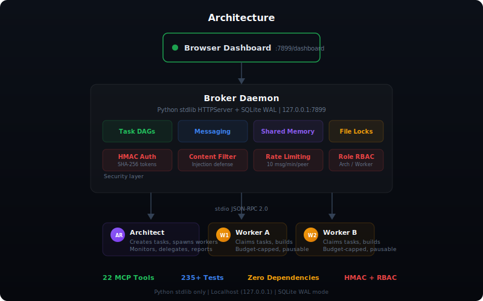

# C2 Lattice

> Multi-agent coordination for Claude Code. Task DAGs, HMAC auth, browser dashboard. Python stdlib only.


## What It Does

- **Coordinate multiple Claude Code sessions** through a localhost broker with task dependencies, messaging, and file locks.
- **Monitor everything from a browser dashboard** with real-time peer status, task progress, and escalation alerts.
- **Secure inter-agent communication** with HMAC-SHA256 auth, content filtering, rate limiting, and role-based access control.

## Quick Start

```bash
python install.py          # Register MCP server globally
python launch.py           # Start broker + open dashboard
claude                     # Open Claude Code sessions
```

The installer registers `c2-lattice` as an MCP server in your Claude Code settings. The launcher starts the broker daemon and opens the dashboard in your browser. Each Claude Code session automatically connects to the broker and receives 22 coordination tools.

## Architecture

<p align="center">
  
</p>

The **broker** is a threaded HTTP server (`http.server` + `ThreadingMixIn`) backed by SQLite in WAL mode. It runs on `127.0.0.1:7899` and handles peer registration, task routing, message delivery, and security enforcement.

Each Claude Code session runs its own **MCP server** over stdio (JSON-RPC 2.0). On startup, the MCP server auto-starts the broker if needed, registers with it, and begins heartbeating every 3 seconds in a background thread. Heartbeats carry git state (branch, dirty files, last commit) and poll for incoming messages.

The **dashboard** is a single-file HTML page served by the broker. It auto-refreshes to show peer status, task DAGs, shared memory, file locks, and activity logs.

## Features

| Feature | Description |
|---------|-------------|
| 22 MCP Tools | Full coordination toolkit: discovery, messaging, tasks, locks, memory, escalation |
| Task DAGs | Create tasks with `blocked_by` dependencies; downstream tasks auto-unblock on completion |
| HMAC-SHA256 Auth | Signed tokens issued at registration, verified on every request |
| Role-Based Access | Architect vs. worker permissions (broadcast, spawn, pause/resume are architect-only) |
| Content Filtering | Blocks tool_use payloads, function-call JSON, base64 blobs, data URIs, long paths |
| Rate Limiting | 10 messages per minute per peer, 10KB message cap, 100KB request body limit |
| Browser Dashboard | Bento-grid command center with peer cards, task DAG, memory viewer, activity log |
| Dead Peer Recovery | Heartbeat timeout detection, automatic lock release, task reassignment |
| File Locks | Path-normalized mutual exclusion; auto-released when a peer dies |
| Shared Memory | Typed key-value store (decision/fact/constraint/artifact) with version history and confidence levels |
| Worker Spawn | Architect can open new Claude Code terminal sessions that auto-register as workers |
| Run Management | Group tasks and messages by run ID; resume runs across session restarts |
| Zero Dependencies | Python stdlib only -- no pip install, no node_modules, no Docker |

## Security

All communication is **localhost only** (`127.0.0.1`). The broker never binds to external interfaces.

- **HMAC-SHA256 tokens** -- issued at registration, required on all authenticated endpoints, validated with constant-time comparison
- **Role-based access control** -- architect, worker, and system roles with distinct permission sets
- **Content filtering** -- rejects messages containing tool_use blocks, function-call JSON, base64 blobs, data URIs, and deep file paths
- **Rate limiting** -- 10 messages per minute per peer, auto-pause after 20 cumulative rejections
- **Request size caps** -- 10KB per message, 100KB per request body
- **Unicode normalization** -- NFKC normalization prevents homoglyph bypass attacks
- **Audit trail** -- all actions logged to SQLite with timestamps and peer IDs

## MCP Tools

### Discovery

| Tool | Risk | Description |
|------|------|-------------|
| `list_peers` | Low | List all active peers with ID, role, summary, git state |
| `set_summary` | Low | Set a short description of what this session is working on |
| `view_dashboard` | Low | Quick status board of all peers; returns dashboard URL |

### Messaging

| Tool | Risk | Description |
|------|------|-------------|
| `send_message` | Medium | Send a message to a specific peer (7 categories) |
| `check_messages` | Low | Retrieve and mark-as-read all pending messages |
| `broadcast` | Medium | Architect-only: send a message to all active peers |

### Tasks

| Tool | Risk | Description |
|------|------|-------------|
| `create_task` | Medium | Create a task with optional `blocked_by` dependencies and run ID |
| `list_tasks` | Low | List tasks filtered by status; shows claimability for pending tasks |
| `get_task` | Low | Full task details including artifacts, dependencies, and blockers |
| `claim_task` | Medium | Claim a pending task; fails if dependencies are unmet |
| `complete_task` | Medium | Mark task done with artifacts (summary, files, tests, risks) |

### File Locks

| Tool | Risk | Description |
|------|------|-------------|
| `lock_file` | Medium | Reserve a file to prevent concurrent edits |
| `unlock_file` | Medium | Release a file lock |
| `list_locks` | Low | Show all locked files and their owners |

### Memory

| Tool | Risk | Description |
|------|------|-------------|
| `set_memory` | Medium | Store a typed key-value entry with confidence and version tracking |
| `get_memory` | Low | Read a key or list all entries; filter by type |

### Escalation

| Tool | Risk | Description |
|------|------|-------------|
| `raise_blocker` | High | Escalate a blocker to the architect; auto-forwards regardless of recipient |
| `request_review` | High | Request architect sign-off before proceeding |

### Management

| Tool | Risk | Description |
|------|------|-------------|
| `spawn_worker` | High | Architect-only: open a new Claude Code terminal session as a worker |
| `log_conversation` | Low | Log a conversation turn for cross-session visibility |
| `get_conversation` | Low | View conversation log (workers: own only; architect: any peer) |
| `resume_run` | Low | Resume a run from a previous session with full state recovery |

## Testing

| Suite | Tests | What It Covers |
|-------|-------|----------------|
| Unit/Integration | 104 | Core broker: registration, auth, tasks, memory, locks, messaging, content filtering |
| Stress | 49 | Edge cases, prompt injection, Unicode attacks, concurrency, rate limiting |
| Chaos | 27 | Multi-run DAGs, worker death mid-task, budget exhaustion, lock contention, pause/resume |
| E2E Pipeline | Full | Architect creates DAG, workers claim/complete, dependencies auto-unblock, final review |
| Idiot-Proof | 59 | Garbage input, malformed JSON, missing fields, empty strings, abuse patterns |

All test suites start their own broker instance and clean up afterward.

```bash
# Run all tests
python test_broker.py       # Unit + integration (104 tests)
python stress_test.py       # Stress + edge cases (49 tests)
python chaos_test.py        # Chaos + failure scenarios (27 tests)
python e2e_test.py          # End-to-end pipeline
python idiot_test.py        # Abuse resistance (59 tests)
```

## How It Works

1. **Broker starts** on `127.0.0.1:7899` with a SQLite database in WAL mode for concurrent reads.
2. **Each Claude Code session** runs an MCP server (stdio transport) that registers with the broker and receives an HMAC-signed auth token.
3. **The architect** creates a task DAG using `create_task` with `blocked_by` dependencies, stores decisions in shared memory, and spawns workers.
4. **Workers** call `list_tasks` to find claimable work, `claim_task` to take ownership, do the work, then `complete_task` with artifacts. Completing a task auto-unblocks downstream dependents.
5. **The dashboard** at `http://127.0.0.1:7899/dashboard` shows peer status, task progress, shared memory, file locks, and the activity log in real time.
6. **If a worker dies**, the broker detects the missed heartbeat, marks the peer as dead, releases its file locks, and the task can be reclaimed by another worker.

## Configuration

| Variable | Default | Description |
|----------|---------|-------------|
| `PEER_ID` | auto-generated | Human-readable peer name (e.g., `architect`, `worker-fe`) |
| `PEER_ROLE` | `worker` | Peer role: `architect` or `worker` |
| `PEER_DIR` | current directory | Working directory for the session |
| `C2_LATTICE_PORT` | `7899` | Broker HTTP port |
| `C2_LATTICE_DB` | `~/.c2-lattice.db` | SQLite database file path |
| `C2_LATTICE_SECRET` | random per run | HMAC signing secret (auto-generated if not set) |

## Project Structure

```
c2-lattice/
  broker.py          Core HTTP broker (threading + SQLite WAL)
  mcp_server.py      MCP server (22 tools, stdio JSON-RPC 2.0)
  dashboard.html     Browser dashboard (single-file, auto-refresh)
  install.py         One-command installer (registers MCP server)
  launch.py          One-command launcher (broker + dashboard)
  test_broker.py     Unit/integration tests (104)
  stress_test.py     Stress tests (49)
  chaos_test.py      Chaos tests (27)
  e2e_test.py        E2E pipeline test
  idiot_test.py      Abuse resistance tests (59)
  CONTRIBUTING.md    Contribution guidelines
  LICENSE            MIT license
```

## Contributing

See [CONTRIBUTING.md](CONTRIBUTING.md) for guidelines.

## License

[MIT](LICENSE)
